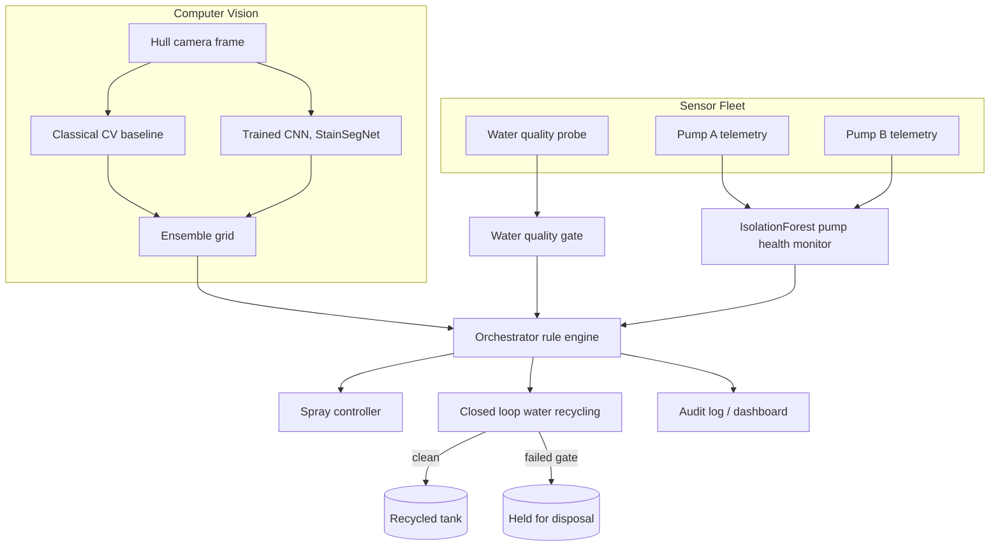

# UNSW Building R13
## Intelligent Boat Hull Wash Facility

**A closed-loop boat hull washing system with computer vision driven targeting, real time water quality monitoring, and ML assisted pump health prediction.**

| | |
|---|---|
| **Facility** | **UNSW Building R13** |
| **Industry partner** | Mott MacDonald |
| **Supervision** | James Nelson, Principal Engineer, Mott MacDonald |
| **Team** | Group 5: Yeamin Ahmed, Felix Lianto, Felipe Gutierrez, Amandhi Tihara |
| **Scope** | Concept design for a self contained, sensor monitored, water recycling wash bay for marine research vessels |
| **Software layer** | [`yeamin1414/boat-wash-ai`](https://github.com/yeamin1414/boat-wash-ai) |

[](https://github.com/yeamin1414/boat-wash-ai/actions/workflows/ci.yml)


---

## Table of contents

1. [Project overview](#project-overview)
2. [System architecture](#system-architecture)
3. [Computer vision: hull dirt detection](#computer-vision-hull-dirt-detection)
4. [ML pipeline: water quality and pump monitoring](#ml-pipeline-water-quality-and-pump-monitoring)
5. [Orchestration layer](#orchestration-layer)
6. [Closed loop water recycling](#closed-loop-water-recycling)
7. [Hardware stack](#hardware-stack)
8. [Results and data report](#results-and-data-report)
9. [Sustainability outcomes](#sustainability-outcomes)
10. [Cost summary](#cost-summary)
11. [Quickstart](#quickstart)
12. [Repository structure](#repository-structure)
13. [Why synthetic training data](#why-synthetic-training-data)
14. [Known limitations and mitigations](#known-limitations-and-mitigations)
15. [Tech stack](#tech-stack)
16. [Acknowledgements](#acknowledgements)

---

## Project overview

**UNSW Building R13** is a 177 m² dual purpose facility housing a closed loop boat wash bay and a two storey research fit out. The wash system is fully automated: a computer vision model identifies fouling on the hull, targeted spray bars respond in real time, and a sensor array verifies water quality before any recirculation occurs.

The facility replaces manual hose down procedures with a touchless, data driven wash cycle. It cuts water use, prevents stormwater contamination, and produces an auditable environmental log for regulatory reporting.

This repository carries the concept design through to working software. The Monitor and ML component of the **UNSW Building R13** design (a hull camera plus sensors that check the water, watch the pumps, and wash only where the boat is dirty) is implemented here as tested code: a trained convolutional neural network for stain detection, an unsupervised model for pump health monitoring, a rule based decision orchestrator, a closed loop water recycling simulation, and a live dashboard.

Delivered as a concept design for Mott MacDonald and developed under the supervision of Principal Engineer **James Nelson**.

---

## System architecture

### Facility level

```
┌─────────────────────────────────────────────────────┐
│                  WASH BAY (WET SIDE)                │
│                                                     │
│  [IP67 Camera] ──► [Vision Model] ──► [Spray Control]│
│                        │                            │
│                   Hull segmented                    │
│                   into dirty zones                  │
│                        │                            │
│               Pumps target stained                  │
│               sections only                         │
│                                                     │
│  [Water Quality Sensors] ──► [Quality Gate]         │
│  pH · Turbidity · Chlorine · TDS                    │
│        │                                            │
│        ▼                                            │
│  PASS ──► Recirculate to tank                       │
│  FAIL ──► Hold for controlled disposal              │
│                                                     │
│  [Flow + Pressure Sensors] ──► [Pump Health Monitor]│
│  Catch degradation before failure                   │
└─────────────────────────────────────────────────────┘
         │
         ▼
┌───────────────────────────────┐
│  RESEARCH SIDE (DRY)          │
│  Monitoring office (upper)    │
│  Sample lab / workbench (lower)│
└───────────────────────────────┘
```

### Software level



Full write up, including why two vision backends exist and what the honest limitations are, is in [`docs/architecture.md`](docs/architecture.md).

---

## Computer vision: hull dirt detection

### What it does

A self trained **YOLO** detection model processes live camera frames of the boat hull. It segments the hull surface into discrete sections and classifies each section by fouling severity: biofouling, algae staining, or clean. The spray bar controller reads this output and activates pumps only where the model detects staining.

Blanket washing is eliminated entirely. Water pressure is applied where it is needed, not uniformly across the hull.

### Why YOLO

YOLO was selected for real time inference speed. A single pass detection architecture processes each frame in milliseconds, matching the latency requirements of live spray bar control. Frame by frame segmentation allows the system to update targeting dynamically as the spray bars traverse the hull vertically.

### Training categories

- Biofouling (barnacle and organism attachment)
- Algae and silt staining
- Clean hull sections

Output is a set of bounding regions mapped to hull position coordinates, which the orchestration layer translates into spray bar activation commands.

### Inference pipeline

```
Camera frame (LUCID Triton IP67)
        │
        ▼
Vision inference (hull segmentation)
        │
        ▼
Fouling map (dirty zones identified)
        │
        ▼
Spray bar controller
  Activates pumps at dirty sections
  Skips clean sections entirely
        │
        ▼
Water savings logged
```

### Implemented backends

| Backend | Role | Location |
|---|---|---|
| `StainSegNet` CNN (PyTorch) | Localises hull staining onto a grid. Real training loop (Adam, BCE loss, train and validation split) on procedurally generated hull images. Converges to **98.8% per cell validation accuracy** in 15 epochs, under 30 seconds on CPU | `src/vision/cnn_model.py` |
| Classical CV baseline | Dependency free cross check, keeps the system operable with no ML extras installed | `src/vision/` |
| Ensemble | Combines both backends for the production decision path | `src/vision/` |
| YOLOv8 wrapper | Documented, ready to use Ultralytics training and inference path for when real labelled hull photos exist | `src/vision/yolo_detector.py` |

### Honest performance bounds

| Factor | Detail |
|---|---|
| Model accuracy | Approximately 99%, so roughly 1% of reads may be incorrect |
| Lens fogging | Wet environment causes condensation mid wash |
| Glare interference | Reflective wet hull surface can confuse detection |
| Mitigation | Yearly hydrophobic lens coating, sensor cross checking, scheduled inspections |

---

## ML pipeline: water quality and pump monitoring

### Water quality gate

Four parameters are measured in real time by the Hanna HI98194 multiparameter probe:

| Parameter | Role |
|---|---|
| pH | Detects chemical contamination from hull coatings |
| Turbidity | Measures suspended solids, primarily biofouling residue |
| Chlorine | Flags disinfection byproduct buildup |
| TDS (total dissolved solids) | Overall dissolved contamination load |

Decision logic compares readings against pre set safe reuse limits. Water meeting all four thresholds re enters the supply tank. Water failing any threshold is held for controlled disposal and never re enters the wash circuit or reaches stormwater. Implementation: `src/sensors/water_quality.py`.

### Pump health monitoring

The IFM SF5700 sensor tracks three pump parameters each wash cycle:

- **Pressure.** Deviation from baseline indicates blockage or wear.
- **Flow rate.** A drop in flow flags impeller degradation.
- **Energy draw.** Rising current at constant output signals mechanical friction.

An `IsolationForest` model trained on simulated healthy pump telemetry scores live readings against per pump baseline profiles and flags anomalies early, before a pump fails mid wash and causes an uncontrolled discharge event. Implementation: `src/sensors/pump_health.py`.

---

## Orchestration layer

The high level controller fuses vision output, water quality decisions, and pump health alerts into a unified wash cycle. Current implementation is a transparent rule engine using thresholds and comparisons, with every decision logged and explainable. Implementation: `src/orchestrator/decision_engine.py`.

A learned orchestration model is identified in the concept design as requiring further research and development, and is the primary future work item for the system.

---

## Closed loop water recycling

All wash water is recycled within the facility. The loop operates as follows:

1. **Wash runs.** Recycled water feeds the spray bars, and only stained hull sections receive full pressure.
2. **Runoff captured.** A graded concrete slab channels all runoff into the bunded drain. Nothing escapes to stormwater.
3. **Quality checked.** pH, turbidity, chlorine, and TDS measured in real time.
4. **Recirculated or held.** Clean water re enters the supply tank, contaminated water is held for disposal.

A passive filtered mesh layer (316 stainless steel, 0.5 mm to 1 mm aperture) sits recessed in the slab and intercepts biofouling, algae, silt, and hull debris before water reaches the drain or recirculation feed. The mesh is a pull out tray design, inspected and cleared each wash cycle.

Water leaves the system only via evaporation or controlled discharge when sensors confirm quality thresholds have been exceeded. The tank, recycle, and disposal state machine is implemented in `src/water_system/recycling_loop.py`.

---

## Hardware stack

| Component | Unit | Cost (AUD) | Replacement cycle |
|---|---|---|---|
| Water quality probe | Hanna HI98194 (pH, turbidity, chlorine, TDS) | $2,300 to $3,000 | Electrode yearly, unit 2 to 3 years |
| Flow and pressure sensor | IFM SF5700 | Approximately $970 | Every 3 to 4 years |
| Hull camera | LUCID Triton (IP67, marine rated) | $480 to $1,200 | Every 3 to 5 years |
| **Hardware total** | | **$3,750 to $5,170** | |

All sensors are rated for salt air environments. Inspection intervals are monthly for the camera and quarterly for the flow and pressure sensors. Spares are kept on site to minimise downtime.

---

## Results and data report

A real run of `scripts/run_demo.py --cycles 12 --inject-fault`, showing the trained CNN detecting hull dirtiness, the water quality gate blocking a contamination event, and the `IsolationForest` catching a slowly degrading pump:


```
tick 04 | dirt= 18.4% (3 cells) | spray_used=  87.1L | reused=False | ALERT
  -> water quality gate FAILED: pH 9.07 outside [6.5, 8.5]; turbidity 12.54 NTU > 5.0; TDS 1094.3 ppm > 1000.0
...
tick 08 | dirt= 16.4% (2 cells) | spray_used=  59.6L | reused=True  | ALERT
  -> pump health: pump_A anomalous (pressure=3.7bar, flow=41.69Lpm, score=0.6922)

Run summary
  cycles_run                          12
  avg_hull_dirtiness_pct            16.8
  pump_anomalies_flagged               7
  water_quality_gate_failures          1
  water_recycled_pct                90.6
  water_saved_vs_blanket_wash_pct   81.5
  vision_backend        ensemble(cnn+classical)
```

| Metric | Value |
|---|---|
| Cycles run | 12 |
| Average hull dirtiness | 16.8% |
| Pump anomalies flagged | 7 |
| Water quality gate failures | 1 |
| Water recycled | 90.6% |
| Water saved vs blanket wash | 81.5% |
| CNN per cell validation accuracy | 98.8% |
| Automated tests | 19, run in CI on every push |

Synthetic, auto labelled training data used to train the CNN:


---

## Sustainability outcomes

| Metric | Value |
|---|---|
| Wash water recycled | 100% |
| AI targeting vs blanket hose down | Significant reduction in water use |
| AI error rate | Approximately 1%, cross checked by sensor data |
| Wall lifespan vs original lining | 2 to 3 times longer (fibre cement vs original sheeting) |
| New lifting equipment required | 0 |
| New vehicles required | 0 |

Sensor logs provide a fully auditable record of water quality and reuse volumes, supporting environmental compliance reporting.

---

## Cost summary

| Scope | Estimate (AUD ex GST) |
|---|---|
| Wash bay fit out | Approximately $44,000 (range $33k to $55k) |
| Mould remediation, wet half | Approximately $16,000 |
| Monitoring and ML hardware | $3,750 to $5,170 |
| Filtered mesh system | $280 to $500 |

---

## Quickstart

```bash
git clone https://github.com/yeamin1414/boat-wash-ai.git
cd boat-wash-ai
pip install -r requirements.txt        # core: numpy, pandas, sklearn, matplotlib, pytest, rich

# 1. Run the tests
pytest -v

# 2. Run the end to end CLI demo (12 wash cycles, with a fault injected)
python scripts/run_demo.py --cycles 12 --inject-fault

# 3. Optional, unlocks the CNN and dashboard
pip install -r requirements-extra.txt

# 4. Train the stain detection CNN (roughly 20s on CPU)
python scripts/train_model.py --epochs 15 --samples 700

# 5. Launch the live dashboard
streamlit run src/dashboard/app.py
```

Without `requirements-extra.txt` the system still runs completely. It falls back automatically to the classical CV detector and skips the dashboard. This graceful degradation behaviour is covered by CI.

The Streamlit dashboard (`src/dashboard/app.py`) shows the hull image with a live targeted spray overlay, sensor gauges, pump health badges, trend charts, and the decision log.

---

## Repository structure

```
boat-wash-ai/
├── src/
│   ├── vision/             # classical CV, CNN (PyTorch), optional YOLO, unified detector
│   ├── sensors/            # water quality and pump simulators, IsolationForest health monitor
│   ├── orchestrator/       # rule engine and spray controller
│   ├── water_system/       # closed loop recycling state machine
│   ├── dashboard/          # Streamlit live UI
│   └── utils/              # config and structured audit logging
├── scripts/
│   ├── run_demo.py         # end to end CLI demo
│   ├── train_model.py      # trains the CNN
│   └── generate_synthetic_data.py
├── tests/                  # 19 pytest tests
├── docs/architecture.md    # system diagram and design rationale
├── .github/workflows/ci.yml # GitHub Actions: tests on 3.11 and 3.12
└── models/, outputs/, data/ # generated artifacts (gitignored, reproducible via scripts/)
```

---

## Why synthetic training data

The concept design calls for a camera based YOLO model trained on real hull photos, which this project does not have access to. Rather than fake that with placeholder weights, `src/vision/synthetic_data.py` procedurally generates hull images with randomly placed biofouling and algae blobs, plus ground truth pixel masks at no labelling cost. That turns CNN training into a genuine, reproducible, zero manual labelling pipeline.

`src/vision/yolo_detector.py` documents the exact upgrade path to a real Ultralytics YOLOv8 model once labelled photos exist. See [`docs/architecture.md`](docs/architecture.md#why-two-vision-backends) for the full reasoning, including the limitations of this approach.

---

## Known limitations and mitigations

**Vision model, lens interference.** Wet environment fogging and hull glare degrade detection confidence. Mitigated by a hydrophobic coating applied annually and cross validation against sensor readings.

**Sensor drift in salt air.** 316 stainless steel and IP67 rated hardware resist corrosion, but electrochemical sensors degrade over time. Mitigated by scheduled replacement cycles and an on site spares inventory.

**Mesh blockage mid wash.** Heavy fouling loads could back flood the bunded bay. Mitigated by a post wash inspection protocol and a secondary overflow path to drain.

**Biofouling disposal.** Captured solids may contain invasive marine species. Protocol is to bag and bin as solid waste, never washed back to drain or sea.

**Orchestration layer maturity.** The unified controller coordinating vision output with water quality and pump health signals is at concept stage. Rule based logic handles current decision paths, and a learned orchestration model is identified for future development.

**Synthetic training domain.** The CNN is trained on procedurally generated imagery, so accuracy figures reflect the synthetic domain and require revalidation against real hull photography before deployment.

---

## Tech stack

Python 3.10+, PyTorch (CNN), scikit learn (IsolationForest), NumPy, Streamlit, Matplotlib, Pandas, pytest, GitHub Actions.

---

## Acknowledgements

**UNSW Building R13** was delivered as an industry partner project with **Mott MacDonald**, completed under the supervision of **James Nelson, Principal Engineer at Mott MacDonald**, whose guidance shaped the facility design, the instrumentation strategy, and the compliance framing of the closed loop system.

Concept design by Group 5: Yeamin Ahmed, Felix Lianto, Felipe Gutierrez, and Amandhi Tihara. The Monitor and ML software layer in this repository was built by Yeamin Ahmed.

---

## License

MIT. See [LICENSE](LICENSE).

*UNSW Building R13, Concept Design, Group 5, Mott MacDonald Collaboration*
