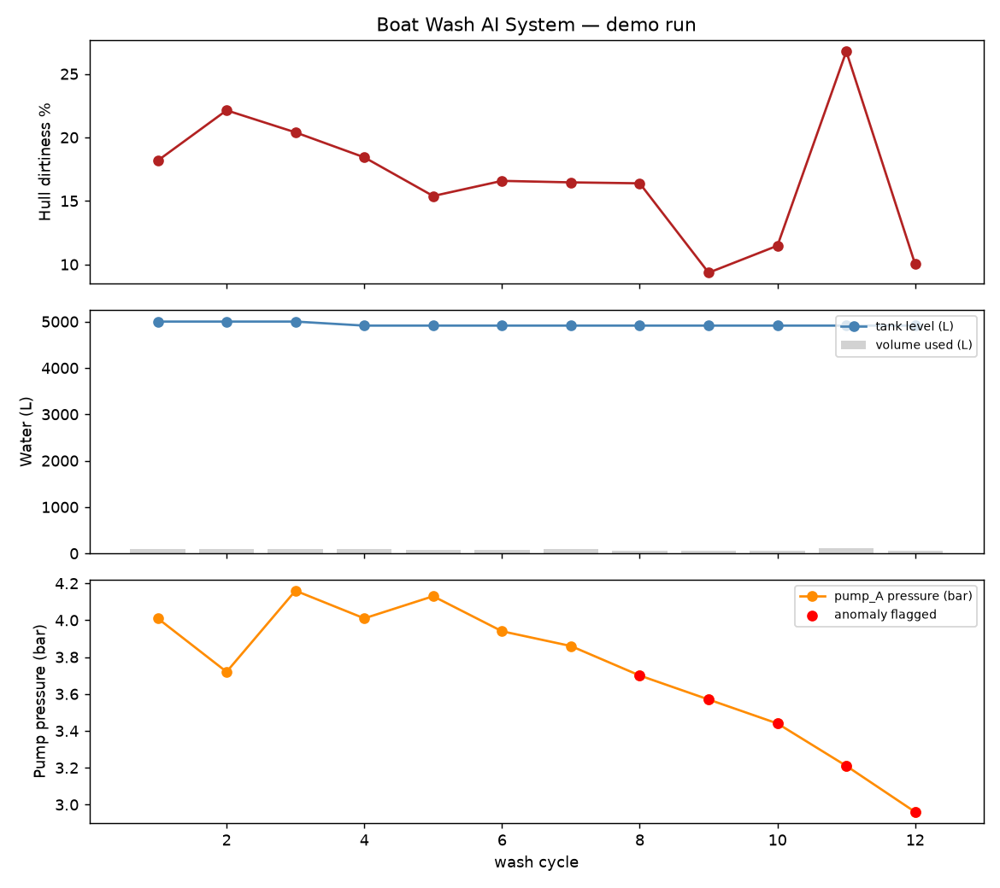
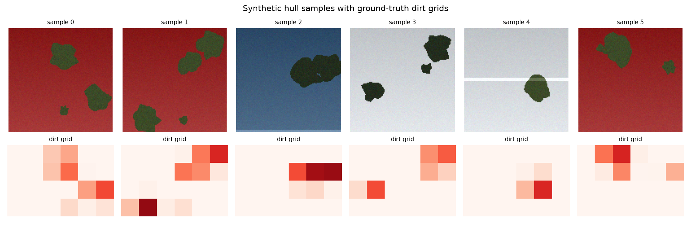
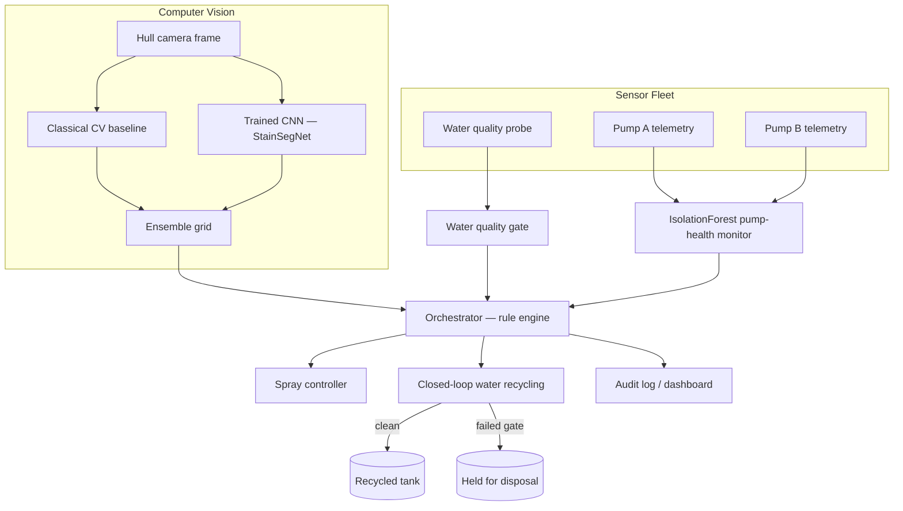

# 🛥️ Boat Wash AI System

**Computer vision + sensor-fusion monitoring for an automated boat wash bay** — the Monitor & ML software layer for Building R13, a real concept-design project for a marine research facility wash bay (2 powered spray bars, closed-loop water recycling, pump + water-quality instrumentation).

[](https://github.com/yeamin1414/boat-wash-ai/actions/workflows/ci.yml)


This repo takes the "Monitor & ML" concept from the engineering design (a boat camera + sensors that "check the water, watch the pumps, and wash only where the boat is dirty") and implements it as **working, tested code**: a trained convolutional neural network for stain detection, an unsupervised ML model for pump-health monitoring, a rule-based decision orchestrator, and a closed-loop water-recycling simulation — plus a live dashboard to watch it all run.

> Built by **Yeamin Ahmed** as the software implementation of the Monitor & ML component from Building R13's Concept Design (Group 5 — Yeamin Ahmed, Felix Lianto, Felipe Gutierrez, Amandhi Tihara).

---

## Demo output

A real run of `scripts/run_demo.py --cycles 12 --inject-fault` — the trained CNN detecting hull dirtiness, the water-quality gate blocking a contamination event, and the IsolationForest catching a slowly degrading pump:



```
tick 04 | dirt= 18.4% (3 cells) | spray_used=  87.1L | reused=False | ALERT
  -> water quality gate FAILED: pH 9.07 outside [6.5, 8.5]; turbidity 12.54 NTU > 5.0; TDS 1094.3 ppm > 1000.0
...
tick 08 | dirt= 16.4% (2 cells) | spray_used=  59.6L | reused=True  | ALERT
  -> pump health: pump_A anomalous (pressure=3.7bar, flow=41.69Lpm, score=0.6922)

Run summary
  cycles_run                          12
  avg_hull_dirtiness_pct            16.8
  pump_anomalies_flagged               7
  water_quality_gate_failures          1
  water_recycled_pct                90.6
  water_saved_vs_blanket_wash_pct   81.5
  vision_backend        ensemble(cnn+classical)
```

Synthetic, auto-labelled training data used to train the CNN (no manual annotation needed — see [Why synthetic data?](#why-synthetic-training-data)):



---

## Features

| Layer | What it does | Where |
|---|---|---|
| 🎥 **Computer vision** | A trained CNN (`StainSegNet`) localises hull staining onto a grid; a dependency-free classical-CV baseline cross-checks it; an ensemble mode combines both | `src/vision/` |
| 🧠 **Deep learning** | Real PyTorch training loop (Adam, BCE loss, train/val split) on procedurally generated hull images — converges to **98.8% per-cell validation accuracy** in 15 epochs / <30s CPU | `src/vision/cnn_model.py` |
| 📈 **Applied ML — predictive maintenance** | `IsolationForest` trained on simulated healthy pump telemetry flags pressure/flow/energy anomalies live, catching a degrading pump before it fails | `src/sensors/pump_health.py` |
| 💧 **Water quality gate** | pH / turbidity / chlorine / TDS thresholds decide whether wash water re-enters the tank or is held for disposal | `src/sensors/water_quality.py` |
| 🤖 **Orchestrator** | Transparent rule engine fusing CV + sensors into spray commands and reuse decisions — every decision is logged and explainable | `src/orchestrator/decision_engine.py` |
| ♻️ **Closed-loop water system** | Tank / recycle / disposal state machine tracking recycled % and water saved vs. a naive blanket hose-down | `src/water_system/recycling_loop.py` |
| 📊 **Live dashboard** | Streamlit app: hull image with a live targeted-spray overlay, sensor gauges, pump health badges, trend charts, decision log | `src/dashboard/app.py` |
| 🧪 **Tests** | 19 pytest tests covering vision, sensors, water system and orchestrator integration, run in CI on every push | `tests/`, `.github/workflows/ci.yml` |
| 🛣️ **YOLO upgrade path** | Documented, ready-to-use Ultralytics YOLOv8 training/inference wrapper for when real labelled hull photos exist | `src/vision/yolo_detector.py` |

---

## Architecture



Full write-up, including **why two vision backends exist and what the honest limitations are**, is in [`docs/architecture.md`](docs/architecture.md).

---

## Quickstart

```bash
git clone https://github.com/yeamin1414/boat-wash-ai.git
cd boat-wash-ai
pip install -r requirements.txt        # core: numpy, pandas, sklearn, matplotlib, pytest, rich

# 1. Run the tests
pytest -v

# 2. Run the end-to-end CLI demo (12 wash cycles, with a fault injected)
python scripts/run_demo.py --cycles 12 --inject-fault

# 3. (optional, unlocks the CNN + dashboard) install extras
pip install -r requirements-extra.txt

# 4. Train the stain-detection CNN (~20s on CPU)
python scripts/train_model.py --epochs 15 --samples 700

# 5. Launch the live dashboard
streamlit run src/dashboard/app.py
```

Without `requirements-extra.txt`, the system still runs completely — it just automatically falls back to the classical CV detector and skips the dashboard. This graceful-degradation behaviour is tested in CI.

---

## Project structure

```
boat-wash-ai/
├── src/
│   ├── vision/            # classical CV, CNN (PyTorch), optional YOLO, unified detector
│   ├── sensors/            # water-quality & pump sensor simulators, IsolationForest health monitor
│   ├── orchestrator/       # rule engine + spray controller
│   ├── water_system/       # closed-loop recycling state machine
│   ├── dashboard/          # Streamlit live UI
│   └── utils/               # config + structured audit logging
├── scripts/
│   ├── run_demo.py          # end-to-end CLI demo
│   ├── train_model.py       # trains the CNN
│   └── generate_synthetic_data.py
├── tests/                    # 19 pytest tests
├── docs/architecture.md      # system diagram + design rationale
├── .github/workflows/ci.yml  # GitHub Actions: tests on 3.11 / 3.12
└── models/, outputs/, data/  # generated artifacts (gitignored, reproducible via scripts/)
```

---

## Why synthetic training data?

The concept design calls for a camera-based YOLO model trained on real hull photos, which this project doesn't have access to. Rather than fake that with placeholder weights, `src/vision/synthetic_data.py` procedurally generates hull images with randomly placed biofouling/algae blobs **and ground-truth pixel masks for free** — turning CNN training into a genuine, reproducible, zero-manual-labelling pipeline. `src/vision/yolo_detector.py` documents the exact upgrade path to a real Ultralytics YOLOv8 model once labelled photos exist. See [`docs/architecture.md`](docs/architecture.md#why-two-vision-backends) for the full reasoning, including the honest limitations of this approach.

---

## Tech stack

Python 3.10+ · PyTorch (CNN) · scikit-learn (IsolationForest) · NumPy · Streamlit · Matplotlib/Pandas · pytest · GitHub Actions

---

## License

MIT — see [LICENSE](LICENSE).
