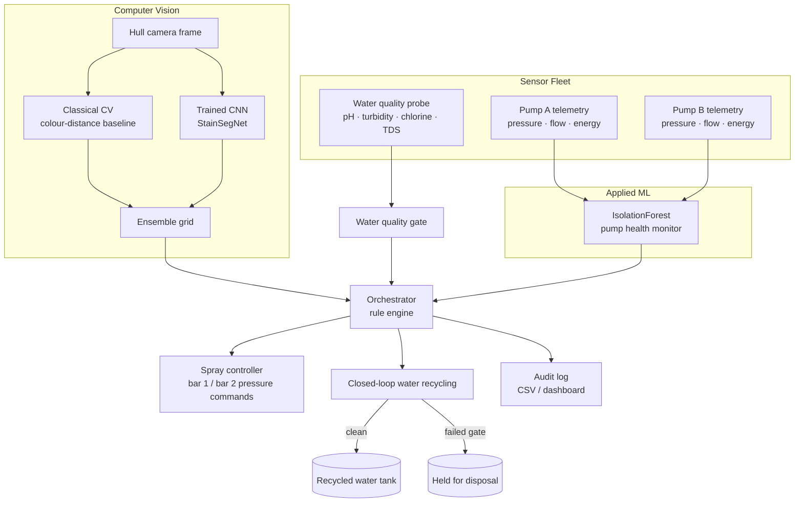

# Architecture

This repo implements the **Monitor & ML** layer of Building R13's boat wash
bay concept design (Group 5, Mott MacDonald project): the software that
watches the water, watches the pumps, finds the dirt on the hull, and
decides what to spray and what to recycle.

## System diagram

## Why two vision backends?

The concept design specifies "a self-trained YOLO model" for stain
detection. Training a real YOLO model needs a labelled dataset of actual
hull photographs, which doesn't exist yet for this project. Rather than
faking that with placeholder weights, this repo ships two backends that are
*actually* trained and *actually* run:

1. **Classical CV** (`src/vision/classical_detector.py`) — colour-distance
   thresholding against the estimated hull colour. Zero dependencies, always
   available, useful as a sanity-check baseline.
2. **CNN** (`src/vision/cnn_model.py`) — a small 4-layer convolutional
   network (`StainSegNet`), trained end-to-end with backpropagation on
   procedurally generated, auto-labelled hull images
   (`src/vision/synthetic_data.py`). It genuinely learns colour/texture
   features and localises stains onto the same grid the orchestrator
   consumes. Trains in well under a minute on CPU.

`src/vision/detector.py` picks the CNN automatically if trained weights
exist, falls back to classical CV otherwise, and can **ensemble** both
(matches the concept design's "cross-checking sensor readings" mitigation
for the ~1% AI error rate it calls out).

A documented, ready-to-use path to a real Ultralytics YOLO model — for when
real hull photos + labels exist — lives in `src/vision/yolo_detector.py`.
It is intentionally not wired in by default: pretending it works without
real training data would misrepresent the system.

## Orchestrator: honest scope

The concept design is explicit that "the high-level orchestrator that ties
it all together still needs more research" and that decisions are "simple
rules (thresholds and comparisons)." `src/orchestrator/decision_engine.py`
is built to that same honest scope: a transparent, auditable rule engine —
not a black-box planner — so every spray/reuse/alert decision is traceable
back to a specific sensor reading or vision score in the CSV audit log.

## Module map

| Module | Concept-design slide | What it does |
|---|---|---|
| `src/vision/` | "Find the dirt" | Classical CV + trained CNN + optional YOLO stain detection |
| `src/sensors/simulator.py` | Hanna HI98194 / IFM SF5700 hardware table | Realistic noisy sensor simulation incl. faults & pump degradation |
| `src/sensors/water_quality.py` | "Water quality gate" | pH / turbidity / chlorine / TDS threshold gate |
| `src/sensors/pump_health.py` | "Watch the pumps" | IsolationForest anomaly detection (z-score fallback) |
| `src/orchestrator/` | "Targeted spray" / orchestrator | Rule engine tying CV + sensors into spray & reuse decisions |
| `src/water_system/recycling_loop.py` | "Water recycling system" (100% loop) | Closed-loop tank/recycle/disposal state machine |
| `src/dashboard/app.py` | "Smart monitoring — less water, less waste" | Live Streamlit visualisation |

## Known limitations (stated up front, not discovered later)

- The CV models are trained on **procedurally generated synthetic images**,
  not real hull photographs — accuracy claims only hold within this
  simulated distribution. Swapping in real, labelled photos is the natural
  next step (`src/vision/yolo_detector.py` is ready for that).
- The IsolationForest pump model is trained on simulated "normal"
  telemetry; a production deployment should retrain it on real historical
  pump data.
- The orchestrator is deliberately rule-based, matching the concept
  design's own stated scope — a learned policy is future work, not claimed
  functionality.
